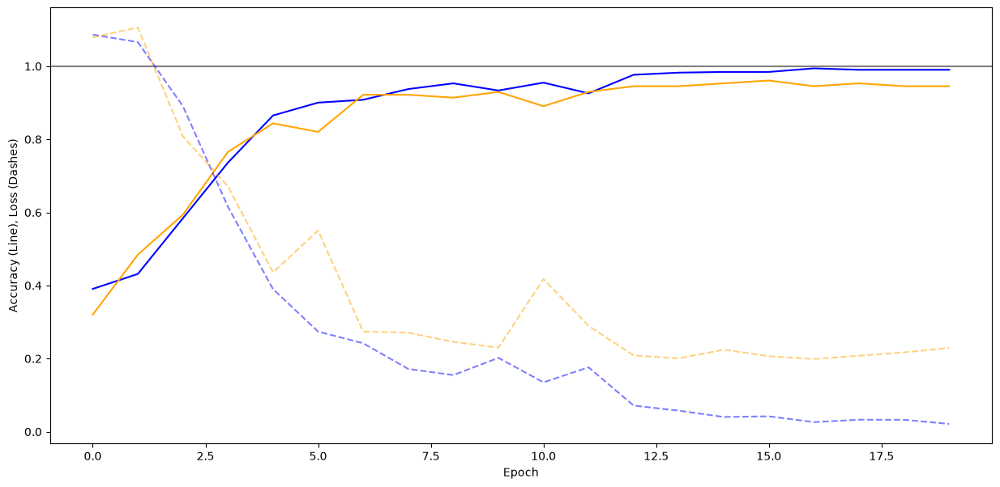
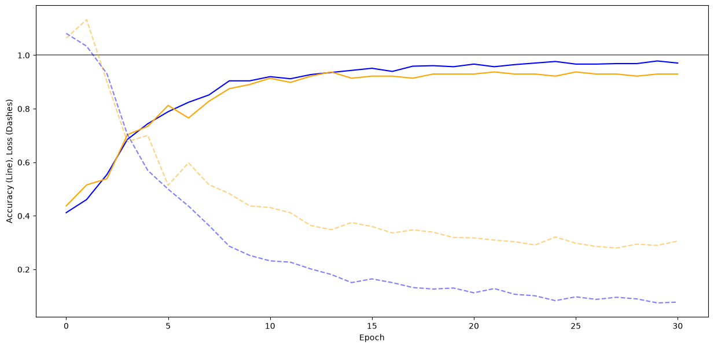
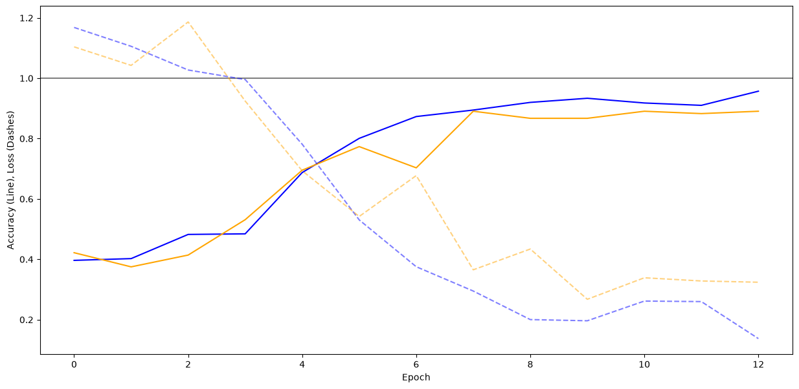
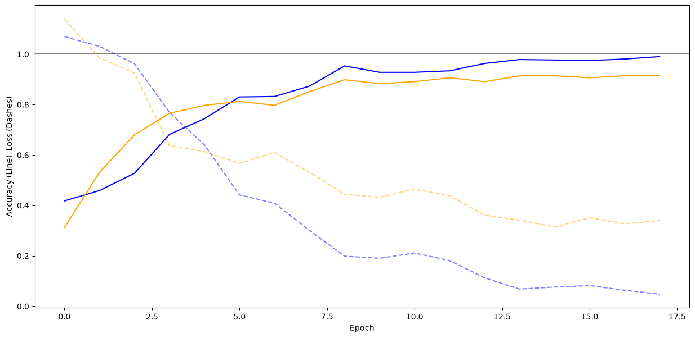
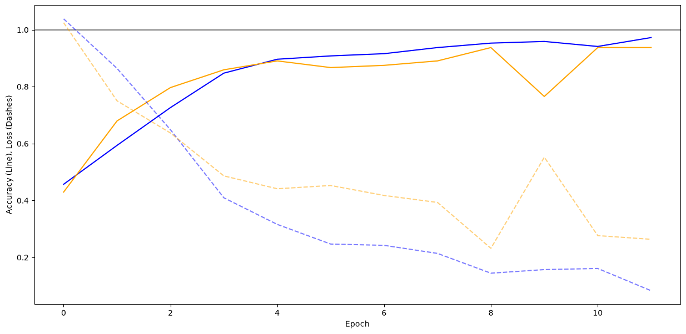
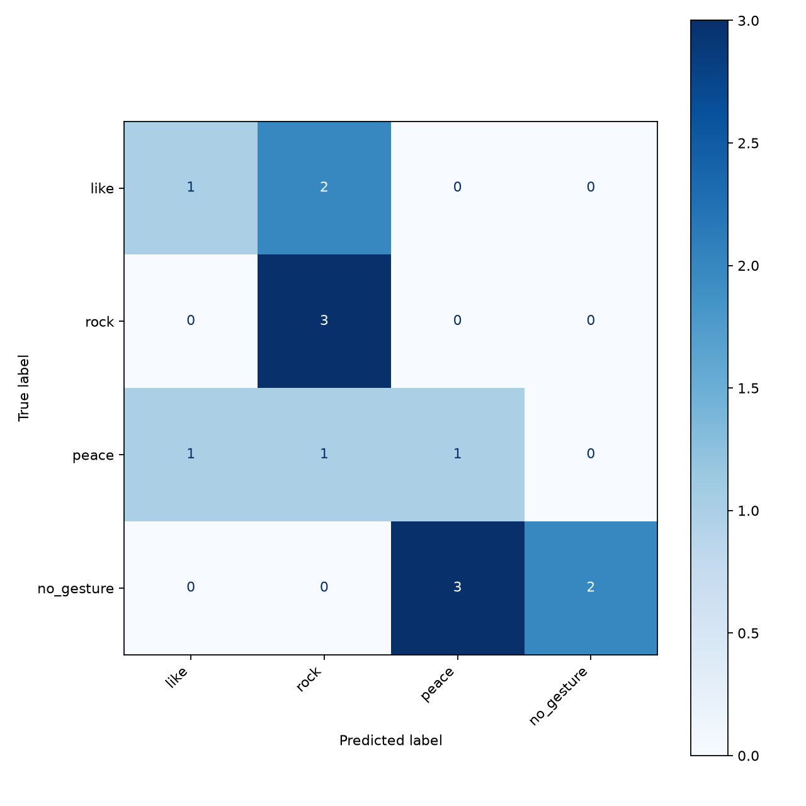

# Exploring Hyperparameters

    I chose the following values:
    leaky_relu, elu, relu, selu and swish

    Validation accuracy was used as the main performance metric because it measures how well the network generalizes to unseen images.
    Validation loss was also monitored to detect overfitting.
    Due to stochastic elements in training, results may vary between runs. Therefore, multiple plots where generated for each function.

    The results are:

    | activation function | best val_accuracy | best val_loss | n epochs  |
    |---------------------|-------------------|---------------|-----------|
    | elu                 | 0.9375            | 0.2390        | 19        |
    | relu                | 0.9297            | 0.2897        | 30        |
    | selu                | 0.8828            | 0.2675        | 13        |
    | swish               | 0.9062            | 0.4380        | 18        |
    | leaky_relu          | 0.9375            | 0.2637        | 12        |
    |_____________________|___________________|_______________|___________|

Elu

Relu

Selu

Swish

Leaky Relu

# Gathering a Dataset

    A model was trained using hyperparameters.ipynb by setting CONDITIONS = ['like', 'peace', 'rock']
    The result can be found at 02-dataset/gesture_recognition.keras
    The exercise was a bit unambiguous whether the final plot should be a single one or for each tutor and personal image set
    Therefor I did both and added them to 02-dataset.

The combined result looks like this:

# Gesture-based Media Controls

    A model was trained using hyperparameters.ipynb by setting CONDITIONS = ['like', 'stop', 'peace']
    The result can be found at 03-media_control/gesture_recognition.keras
    Controls:
        Like will start the track
        Stop will pause the track
        Piece will skip the track
        Q will quit the application
    The green rectangle indicates the part used to make the prediction. It will select the larges non-white object in the frame. To get more accurate results, it helps to use a virtual background set to white. This comes build-in with mac-os but you can achieve the same using OBS and a virtual background plugin. Also you can simply use a white cartboard but this requires good lighting conditions and adjusting the --white-threshold
